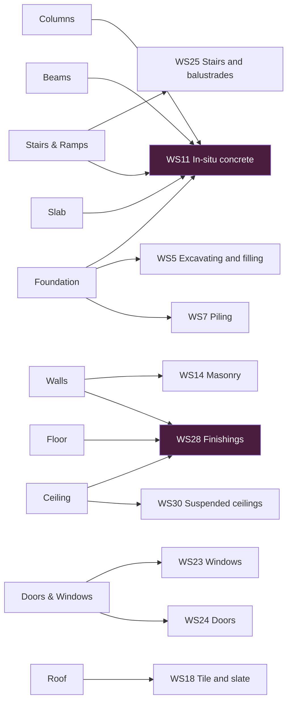

# Quanto — Architecture contract

Session 1 output. Defines the objects and the rule layers. Grounded in NRM2 text
extracted in `reference/nrm2-extracted-rules.md` — every rule cited there is quoted
from the RICS document, not remembered.

UI authority stays `demo-ui-plan/`. Where this document and a UI doc disagree, the UI
doc wins. Where either disagrees with `demo-ui-plan/open-questions.md`, the question wins.

---

## 1. The core idea

Do not build an NRM2 AI. Build a **deterministic measurement engine with an AI-powered
extraction layer**.

```
AI / vision          →  finds what exists on the drawing
Structured model     →  records what we know about it
Rule engine          →  decides how it is measured and described
Grouping             →  decides what becomes one commercial line
```

The AI is responsible for things it is good at: reading drawings, identifying objects,
reading dimensions, resolving ambiguous labels, extracting specifications, and flagging
low confidence. It is responsible for nothing else.

**An LLM never computes a number, never applies a deduction, and never writes a final
description freehand.** A hallucinated 4074.08 m2 is indistinguishable from a correct one.

---


## 2. Three objects

```
PDF vector
   |
   v
Candidate            something the extractor thinks is a building object
   |                 has geometry, source evidence, a confidence, no commercial meaning
   v
MeasuredWorkObject   one real building object, measured, with classification facts
   |                 THE central entity. Everything else is a view over these.
   |
   +-- GROUP BY (family, floor)   -->  Workbook       the workings
   +-- GROUP BY aggregation_key   -->  BOQ item       the bill
```

That last split is the whole design. The Workbook and the BOQ are **the same set of
objects under two different GROUP BY keys**. Nothing is transformed between them.

This is why the workbook is not the bill, and why it must not be built from bill lines:
`takeoff/workbook.md` — *"Workbook is a quantities register. Bill lines are created once,
at the end, from confirmed quantities. A workbook is not made from bill lines."*

### 2.1 MeasuredWorkObject

```
MeasuredWorkObject
  id

  source                          # evidence. every number traceable to ink
    sheet_id
    viewport_id
    bbox
    text_snippet                  # the schedule cell or spec clause, if any

  geometry                        # world coordinates, mm. raw facts only
    primitive                     # point | box | line | polyline | polygon
    points[]
    length | width | height | thickness | area | volume

  classification                  # facts, extracted or confirmed. NOT conclusions
    element                       # wall | column | beam | slab | door | ...
    material                      # blockwork | brickwork | concrete grade | timber | ...
    construction_type
    internal_external
    level_ref
    family_ref                    # the M-code, D-code, W-code from the schedule

  quantity                        # never overwritten. gross and net both survive
    gross
    deductions[]  { reason, source_object_id, amount }
    net
    calc                          # expression tree, renders to the workbook Calc column

  confidence
    overall
    geometry
    classification

  confirmed_by_user               # hash of the content that was confirmed
```

Three rules about this object:

**It stores facts, not conclusions.** `work_section`, `unit`, and `aggregation_key` are
**derived** by the rule engine at read time, never stored. A rule correction then re-bills
the whole project without touching stored data. Baking them in turns every rule fix into
a migration.

**Gross, deductions, and net all survive.** Never `30 - 2.1 = 27.9`. Always:

```
Wall gross area        30.00 m2
  deduct door D1       -2.10 m2   (opening > 0.50 m2, WS14 note 5)
Net measured           27.90 m2
```

Without this the product is unauditable, and audit is the entire value proposition for a
QS tool.

**One run can produce several objects.** A wall run with plaster on both faces is one
centreline and three MeasuredWorkObjects: masonry, face-1 finish, face-2 finish. Same
geometry, three classifications, three units, three different deduction thresholds.
See `demo-ui-plan/takeoff/walls/workbook.md` — this is already the UI's model.

### 2.2 Units — four layers

| Layer | Unit | Rule |
|---|---|---|
| **Source** | whatever the drawing uses | Read as drawn. This set uses feet and inches — `pre/04-height.md` gives Ground 13', typical floors 11', terrace 11'-6' |
| **Internal** | **mm**, always | One canonical unit. All geometry stored in mm, world coordinates. Nothing else is stored |
| **Display** | follows the viewport | A viewport scaled in inches shows inches. The user reads the drawing in the drawing's own units |
| **Output** | NRM2 tabulated units | m, m2, m3, nr, t, and kg or hour where the work section calls for it |

**Conversion happens before rounding, never after.** NRM2 3.2.1 requires dimensions to the
nearest 10mm. Convert to mm first, then round:

```
13' 0"  ->  3962.4 mm  ->  3960 mm      correct
13' 0"  ->  13'        ->  3962.4 mm    precision already lost
```

**Quantity rounding happens at the bill, not in the workings.** NRM2 3.2.1: quantities are
given to the nearest whole number, except tonnes to two decimal places, and a quantity
smaller than one unit is given as one unit. That applies to the BOQ. The workbook keeps
full precision, otherwise the same number is rounded twice.

### 2.3 Where classification facts come from

Every fact on a MeasuredWorkObject has one named source. Nothing is inferred from a model's
general knowledge.

| Fact | Source |
|---|---|
| `family_ref` — the D-code, W-code, M-code | Schedules: door/window schedule, wall type notes |
| Material specification, e.g. concrete grade | **Page notes.** See `demo-ui-plan/open-questions.md` 34 |
| Typical floor grouping, e.g. "2nd-6th" | **Stated on the page.** Not inferred by comparing plans for similarity |
| Storey heights | The elevation. Whole stack confirmed at once — open-questions 22 |
| Slab thickness | The slab's own top and bottom, not floor-to-floor height — open-questions 27 |
| `level_ref` | The viewport the object was found on |

**Consequence: notes are not decoration.** open-questions 34 makes a note a child element of
its viewport, needing no scale. But notes carry the concrete grade, and grade decides which
bill line a volume lands in. So notes need OCR and specification mining, not just display.
An unread note means a volume with no grade and therefore no bill line.

### 2.4 One instance, one level

Every MeasuredWorkObject belongs to exactly one level. Objects that physically span storeys
— a parapet, a stairwell wall, a double-height column — are still assigned a single level
each.

This keeps aggregation and the 3D extrusion simple, at the cost of some physical accuracy
on a small number of objects.

---


## 3. Five rule layers

NRM2 is not a flat list of formulas. It is a hierarchy, and the engine mirrors it:

```
GENERAL RULES              measure net as fixed in position; dims to nearest 10mm;
                           quantities to nearest whole number; curved work on centre line
      |
WORK SECTION RULES         WS14: all walling on the centre line, thicknesses nominal,
                           dimensions exclude applied finishes
      |
ITEM RULES                 WS14 item 1: Walls, overall thickness stated, m2
      |
EXCEPTIONS / CONDITIONS    isolated pier if plan length <= 4x thickness
      |
DESCRIPTION REQUIREMENTS   type and quality of material; critical dimensions; method of
                           fixing where not at contractor discretion; nature of background
      |
DEDUCTION / AGGREGATION    no deduction for voids <= 0.50 m2 (masonry)
```

The engine has five rule types. Each is a machine-readable object, versioned, readable by
a surveyor without reading Python.


| #   | Rule type          | Answers                           | Example                                                            |
| --- | ------------------ | --------------------------------- | ------------------------------------------------------------------ |
| 1   | **Classification** | What work is this?                | element=wall + material=blockwork -> WS14 Masonry, blockwork       |
| 2   | **Measurement**    | How is it measured?               | WS14 wall -> basis=area, unit=m2, on centreline, thickness nominal |
| 3   | **Deduction**      | Gross or net, and what comes out? | deduct openings > 0.50 m2 (WS14 note 5)                            |
| 4   | **Description**    | What must the line say?           | "{thickness} mm thick {material} to {internal_external} walls"     |
| 5   | **Aggregation**    | What becomes one line?            | key = {work_section, work_type, material, thickness, sub/super}    |


Separation and aggregation are **one mechanism**, not two. A 100mm and a 150mm block wall
are separate lines because `thickness` is in the key. Nothing separates them explicitly.

### 3.1 Rule shape

```
Rule: MASONRY-WALL-001
  when:
    element  = wall
    material_category = blockwork
  then:
    work_section      = 14 Masonry
    work_type         = blockwork
    measurement_basis = area
    unit              = m2
  requires:                       # must be known, else raise a typed question
    material
    thickness
    internal_external
  deduct:
    openings where area > 0.50    # WS14 note 5
  aggregate_by:
    work_section, work_type, material, thickness, internal_external, sub_super
  describe:
    "{thickness} mm thick {material} to {internal_external} walls"
```

Descriptions are generated from structured attributes through a template, never invented
freehand by a model. NRM2 3.2.2 requires descriptions to state type and quality of
material, critical dimensions, method of fixing where not at contractor discretion, and
nature of background — a template can guarantee that, a prompt cannot.

Keeping rules as data also means SMM7, CESMM, POMI, or a client's own standard become a
second rule set later, with the drawing-understanding layer untouched. That costs nothing
now and is impossible to retrofit.

---

## 4. BOQ structure

```
BOQ
 +- Work section        "In-situ concrete works"
     +- Subsection      "Substructure" | "Superstructure" | "External works"
         +- BOQ item    Description | Unit | Qty | Rate | Amount
```

Rate and Amount stay empty. They are filled only when the user supplies a rate card.

**A BOQ item is one aggregation_key.** Decided:

- Split by **component** and **specification**
- Split by **substructure / superstructure** heading. WS11 requires it: *"work in
substructures, superstructures or external works should be stated in headings or
descriptions"*
- Do **not** split by floor. Floors are summed. The per-floor workings stay in the
workbook, so the number is still traceable

```
SUBSTRUCTURE
  Concrete in pad foundations, grade 25          m3     25
  Concrete in ground beams, grade 25             m3     18
SUPERSTRUCTURE
  Concrete in suspended slabs, grade 25          m3    970
  Concrete in columns, grade 30                  m3    118
  225 mm thick blockwork to external walls       m2   4074
```

Descriptions are readable and priceable. They are **not** NRM2's own wording — NRM2 would
say "Vertical work, > 300mm thick, in structures, reinforced > 5%", which is unpriceable
to a builder. NRM2 gives us units, measurement rules, deduction thresholds, and the list
of attributes a description must state. It does not give us the description text.

### 4.1 Consequence: element and BOQ item are not one to one

WS11 has no Columns item, no Beams item, no Slab item. It organises concrete by
**orientation and thickness**:

| NRM2 WS11 item | Contains |
|---|---|
| 2 Horizontal work, <= / > 300mm | blinding, beds, foundations, pile caps, column bases, ground beams, slabs, coffered and troughed slabs, landings, beams, attached beams, beam casings, shear heads, kerbs, copings |
| 3 / 4 Sloping work < / > 15 deg | beds, slabs, steps and staircases |
| 5 Vertical work, <= / > 300mm | columns, attached columns, column casings, walls, retaining walls, filling to hollow walls, parapets |

Taken literally, the entire concrete frame bills as four lines: horizontal and vertical
work, each split at 300mm. Slab, Beams, Foundation pile caps and stair landings would all
collapse into Horizontal work > 300mm. A contractor cannot price that — a ground-bearing
raft and a sixth-floor beam have nothing in common commercially.

So we bill at **component** level: "Concrete in suspended slabs, grade 25". NRM2 supplies
the unit, the measurement rules and the deduction thresholds; the description taxonomy is
ours.

This is **not** a departure from the rules. WS11 states it as an option, in the notes on
both items: *"The volumes of each type of horizontal work may be aggregated or given
separately."* Same wording on vertical work.

### 4.2 Therefore work_section belongs to the rule, not the element

The element to work section mapping is many to many:



Four elements feed WS11. Foundation alone feeds three work sections. Walls feeds two, on
the same centreline.

Consequence: an element never carries a work section. Classification rules assign it, from
the facts on the MeasuredWorkObject. This is the concrete reason `work_section` is derived
and not stored (section 2.1).

---


## 5. Scope

**In:** the ten Takeoff elements in `demo-ui-plan/takeoff/`.

**Out for v1:** reinforcement and formwork.

*Open tension:* a standard concrete BOQ bills concrete, reinforcement and formwork
together, so a concrete-only bill cannot be priced as-is by a contractor. Recorded as a
known gap, not resolved.

**Out entirely:** services, external works, preliminaries, rates and pricing.

---


## 6. What would prove this wrong

Stated so the design is falsifiable rather than merely plausible.


| Claim                                                  | Falsified by                                                                                                              |
| ------------------------------------------------------ | ------------------------------------------------------------------------------------------------------------------------- |
| Workbook and BOQ are two GROUP BYs over one object set | Finding a bill line that needs a quantity no MeasuredWorkObject holds, or a workbook row that cannot be derived from them |
| Descriptions can be templated from attributes          | A required NRM2 description that needs prose no attribute set can generate                                                |
| Deriving work_section at read time is cheap enough     | Bill generation on a full package being too slow to be interactive                                                        |
| Rules are readable as data                             | A surveyor unable to check a rule without reading code                                                                    |
| Five rule types are sufficient                         | An NRM2 requirement that fits none of the five                                                                            |


